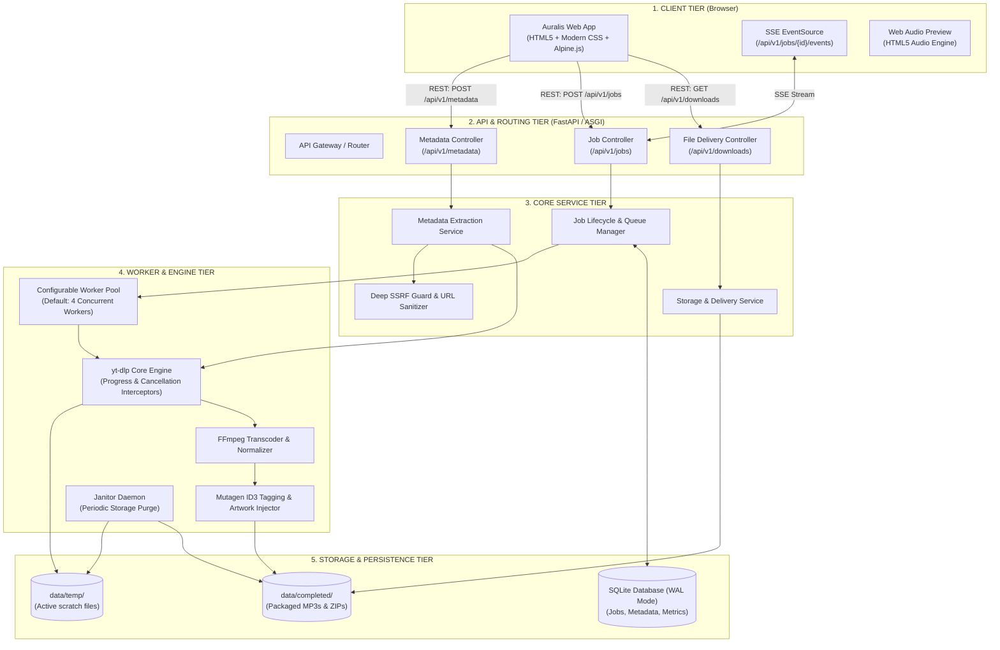
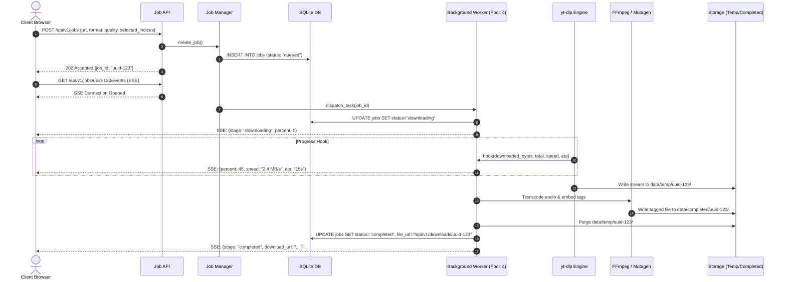
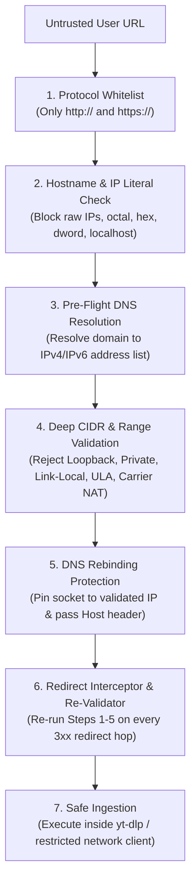
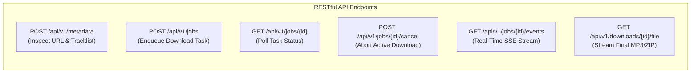
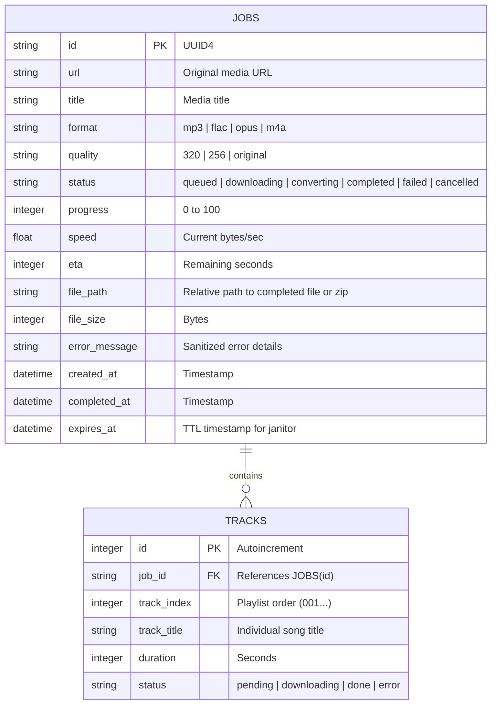

# 🏛️ TARGET ARCHITECTURE PROPOSAL & SPECIFICATION
**Project:** Auralis — Modern Production-Grade Music Downloader  
**Document:** System Architecture, Technical Design & Engineering Blueprint  
**Status:** Architecture Proposal (Approved with Required Corrections — Pre-Implementation Review)  
**Author:** Antigravity Engineering Architecture Team  

---

## Executive Summary & Core Philosophy

The goal of this architectural redesign is to transform the current fragile 53-line prototype into a **robust, production-grade, self-healing music downloading platform** that is:
1. **Practical & Maintainable:** Avoids unnecessary distributed microservices, mandatory Kubernetes, or external broker infrastructure while remaining modular and scalable.
2. **Reliable:** Non-blocking asynchronous engine where server threads never freeze, download progress is reported accurately in real time, and failures are handled gracefully.
3. **True-to-User:** Seamlessly delivers finalized audio files or packaged playlist ZIPs directly to the user's browser with standard attachment headers.
4. **Secure by Design:** Hardened against SSRF (including IPv4/IPv6 loopback, private ranges, link-local, DNS rebinding, and malicious redirects), arbitrary file access, path traversal, command injection, and resource exhaustion.
5. **Honest in Audio Semantics:** Accurately labels audio processing stages, clearly separating native stream extraction from lossy-to-lossy transcoding and lossy-to-lossless container encapsulation.
6. **Prioritized Engineering:** Establishes a disciplined development pipeline where core engine stability, browser delivery, security, and cleanup are rigorously proven before introducing UI polish and advanced media enhancements.

```
┌─────────────────────────────────────────────────────────────┐
│                    ARCHITECTURAL EVOLUTION                  │
├──────────────────────────────┬──────────────────────────────┤
│ CURRENT PROTOTYPE            │ TARGET PRODUCTION PLATFORM   │
├──────────────────────────────┼──────────────────────────────┤
│ Synchronous Flask thread     │ Asynchronous Job Queue Engine│
│ Files trapped on server disk │ Direct browser file streaming│
│ 128 MB binary in git root    │ Dynamic system PATH detector │
│ Zero real-time feedback      │ Server-Sent Events (SSE)     │
│ Fragile YouTube-only regex   │ Multi-layer SSRF & URL Guard │
│ Unstyled raw text errors     │ Glassmorphic reactive web app│
│ No persistence / no tracking │ Lightweight SQLite job cache │
│ Vulnerable to XSS & SSRF     │ Hardened security boundaries │
│ Concurrency unconstrained    │ Configurable Worker Pool     │
│ Misleading audio semantics   │ Strict audio stream taxonomy │
└──────────────────────────────┴──────────────────────────────┘
```

---

## 1. Final Project Architecture

The target architecture is a **modular, service-oriented monolithic architecture**. It decouples HTTP communication, background job processing, media conversion, and file delivery into clean single-responsibility layers while remaining deployable as a single cohesive unit.

### System Architecture Diagram



---

## 2. Recommended Technology Stack

Technologies are selected for **maximum stability, zero external infrastructure friction, low CPU overhead, and long-term maintainability**.

| Component | Recommended Technology | Why Chosen Over Alternatives |
| :--- | :--- | :--- |
| **Backend Framework** | **FastAPI** (Python 3.12) | **Async-native, type-safe, built-in validation.** Eliminates Flask's synchronous threading bottlenecks. Provides native Server-Sent Events (`StreamingResponse`), automatic Pydantic request/response validation, and interactive OpenAPI documentation. |
| **Extraction Engine** | **yt-dlp** (Python API) | **Industry gold standard.** Actively maintained fork of youtube-dl with robust YouTube cipher handling, throttling bypass, and multi-platform extractor support. |
| **Audio Processing** | **FFmpeg 6.x+** | **High-efficiency stream extraction & transcoding.** Resolved dynamically from system PATH, environment variable, or local vendor fallback; not checked into git. |
| **Metadata & ID3 Tagging**| **Mutagen** | **Precise ID3v2.4 audio metadata.** Injects high-resolution APIC album artwork, track numbering, and ReplayGain metadata far more reliably than basic FFmpeg metadata flags. |
| **Task Queue & Workers** | **Python `ThreadPoolExecutor` + Async Event Bus** | **Zero external dependencies with bounded concurrency.** For a single-node application, Redis + Celery adds unnecessary operational complexity (running redis-server daemon, celery worker daemon, beat scheduler). An internal thread pool backed by SQLite handles tasks with a conservative default concurrency (e.g. 4 workers) tuned to host CPU resources. |
| **Database** | **SQLite (WAL Mode)** | **Built into Python standard library.** Zero configuration, ACID-compliant, persistent across reboots, handles concurrent reads seamlessly in Write-Ahead-Logging mode, and requires zero external database servers. |
| **Real-Time Progress** | **Server-Sent Events (SSE)** | **Selected progress mechanism.** Ideal for unidirectional server-to-client telemetry. Operates over standard HTTP/1.1 or HTTP/2, natively supported by browser `EventSource` with automated reconnection, avoiding the bidirectional protocol overhead and handshake complexity of WebSockets. |
| **Frontend Framework**| **Tailwind CSS + Alpine.js + Vanilla JS** | **Ultra-lightweight Single Page Interface.** Zero npm build steps required if served cleanly, or bundled via Vite. No heavy framework hydration bloat. Loads in sub-100ms and provides full reactivity. |
| **Packaging & Zip** | **Python `zipfile` (Deflated 6)** | Standard library stream packaging for playlist archives with zero extra dependencies. |
| **Production Server** | **Uvicorn / Hypercorn** | High-performance ASGI web server with worker management and graceful shutdown. |

---

## 3. Audio Format Semantics & Encoding Pipeline

It is vital to be technologically accurate about audio encoding to avoid misleading the user regarding audio quality:

```
┌─────────────────────────────────────────────────────────────────────────────────┐
│                           AUDIO QUALITY TAXONOMY                                │
├──────────────────────────┬──────────────────────────────────────────────────────┤
│ Format Option            │ Technical Nature & Acoustic Truth                    │
├──────────────────────────┼──────────────────────────────────────────────────────┤
│ 1. Native / Direct Stream│ • Direct extraction (Opus ~50-160 kbps or AAC ~128k) │
│    Copy (Opus / M4A)     │ • Zero re-encoding; ZERO generational quality loss   │
│                          │ • Fast execution (< 2 seconds); lowest CPU usage     │
├──────────────────────────┼──────────────────────────────────────────────────────┤
│ 2. Transcoded MP3        │ • Lossy-to-lossy transcode (e.g. 320k, 256k, VBR V0) │
│    (320k / 256k / VBR)   │ • Does NOT increase fidelity; introduces mild codec  │
│                          │   generation loss                                    │
│                          │ • Provides maximum compatibility with legacy players │
├──────────────────────────┼──────────────────────────────────────────────────────┤
│ 3. Transcoded FLAC       │ • Lossy source decoded to PCM, encapsulated in FLAC  │
│    (Lossless Container)  │ • Does NOT restore discarded audio frequencies       │
│                          │ • Avoids ANY FURTHER lossy compression artifacts     │
│                          │ • Preserves exactly what was decoded from stream     │
├──────────────────────────┼──────────────────────────────────────────────────────┤
│ 4. True Lossless Source  │ • Only applicable if source provider provides FLAC/  │
│    (Where Applicable)    │   ALAC original masters (future external providers)  │
└──────────────────────────┴──────────────────────────────────────────────────────┘
```

### Technical Encoding Strategy
- **Default Recommendation:** Present "Best Native Audio (Opus/M4A)" as the optimal choice for audio fidelity and speed, with "MP3 (320 kbps)" clearly labeled as "High Compatibility".
- **Transcoded FLAC Disclosure:** Clearly document in the UI that FLAC provides a lossless container of the decoded YouTube audio stream, preserving decoded waveform fidelity without secondary lossy compression, but cannot magically synthesize frequencies eliminated by YouTube's lossy encoder.

---

## 4. Download Engine Architecture

The download engine is designed to handle network drops, slow playlists, audio transcoding, tagging, cancellation, and cleanup without leaking memory or file descriptors.



### Technical Engine Rules

#### 1. Configurable Concurrency with Conservative Defaults
- Concurrency is managed via `MAX_CONCURRENT_WORKERS` in `app/core/config.py` (Default: **4**).
- *Rationale:* FFmpeg audio encoding is CPU-intensive and multi-threaded by default. Limiting concurrent worker jobs to 4 prevents CPU thrashing and ensures the host server retains headroom to respond promptly to incoming HTTP requests.
- Jobs exceeding worker capacity sit in a `queued` state in SQLite and are picked up sequentially.

#### 2. Isolated Scratch Directory per Job
- Every download job is allocated a dedicated sandbox: `data/temp/{job_id}/`.
- Eliminates filename collision and concurrency race conditions across simultaneous downloads.

#### 3. Granular Progress Interception
`yt-dlp` provides hooks that are intercepted by the worker:
```python
def progress_hook(d: dict, job_id: str, cancel_event: threading.Event):
    if cancel_event.is_set():
        raise DownloadCancelledException("Job was cancelled by user.")
        
    if d['status'] == 'downloading':
        total = d.get('total_bytes') or d.get('total_bytes_estimate') or 1
        downloaded = d.get('downloaded_bytes', 0)
        percent = min(100.0, round((downloaded / total) * 100, 1))
        speed = d.get('speed', 0) or 0
        eta = d.get('eta', 0) or 0
        
        JobManager.emit_progress(job_id, {
            "stage": "downloading",
            "percent": percent,
            "speed_bytes": speed,
            "eta_seconds": eta,
            "current_track": d.get('info_dict', {}).get('title', 'Unknown')
        })
```

#### 4. Clean Cancellation Token
- Each active job registers a `threading.Event`.
- When `POST /api/v1/jobs/{id}/cancel` is called, the event is set.
- The hook raises `DownloadCancelledException`, terminating the process and triggering immediate cleanup of `data/temp/{job_id}/`.

#### 5. Proper Playlist vs. Single Track Naming
- If playlist: `%(playlist_index)03d - %(title)s.%(ext)s`
- If single track: `%(title)s.%(ext)s` (strictly prevents the `NA - ` filename bug).
- Filenames are sanitized through strict path-safety cleaners to strip Windows-reserved characters (`:`, `*`, `?`, `"`, `<`, `>`, `|`, `/`, `\`).

---

## 5. Security Architecture (Deep SSRF, XSS & System Hardening)

Because this application accepts arbitrary user URLs and executes command-line subtools, security must be comprehensive.



### Detailed SSRF Defense Specification
The application must **never rely solely on hostname string checks**. The following multi-layered defenses are implemented in `app/core/security.py`:

#### A. Protocol Whitelist
- Permitted schemes: `http://` and `https://` only.
- Explicitly blocked: `file://`, `gopher://`, `ftp://`, `data:`, `dict://`, `ldap://`, etc.

#### B. IP Literal & Suspicious Representation Blocking
- Blocks raw IP addresses in user input if attempted directly.
- Detects and rejects obfuscated IP literals:
  - Octal representations (e.g. `0177.0.0.1`)
  - Hexadecimal representations (e.g. `0x7f000001`)
  - Dword / integer formats (e.g. `2130706433`)
  - IPv6 enclosed brackets with compressed zero forms (e.g. `[::1]`, `[0:0:0:0:0:0:0:1]`)

#### C. Internal & Localhost Hostname Blocking
- Blocks `localhost`, `*.localhost`, `*.local`, `*.internal`, `*.lan`, `*.home`, `*.corp`.

#### D. Pre-Flight DNS Resolution & Comprehensive CIDR Blacklisting
Before any outbound connection is established, the hostname is resolved via `socket.getaddrinfo()` to all associated IPv4 and IPv6 addresses. Every resolved address is evaluated against forbidden network ranges:

| Address Category | IPv4 CIDR Blocks | IPv6 CIDR Blocks |
| :--- | :--- | :--- |
| **Loopback** | `127.0.0.0/8` | `::1/128` |
| **Private Networks** | `10.0.0.0/8`<br>`172.16.0.0/12`<br>`192.168.0.0/16` | `fc00::/7` (Unique Local Address - ULA) |
| **Link-Local / APIPA**| `169.254.0.0/16` | `fe80::/10` |
| **Carrier-Grade NAT** | `100.64.0.0/10` (RFC 6598) | N/A |
| **Site-Local (Deprecated)**| N/A | `fec0::/10` |
| **IPv4-Mapped IPv6** | Handled by unwrapping `::ffff:x.x.x.x` | `::ffff:0:0/96` |
| **Unspecified / Current**| `0.0.0.0/8` | `::/128` |
| **Broadcast / Multicast**| `224.0.0.0/4`<br>`255.255.255.255/32` | `ff00::/8` |

If **any** resolved IP address falls within a forbidden range, the request is aborted immediately with `SSRFSecurityException`.

#### E. DNS Rebinding Protection (TOCTOU Defense)
To prevent Time-of-Check to Time-of-Use (TOCTOU) DNS rebinding attacks (where a malicious domain initially resolves to a benign public IP during validation, then switches to `127.0.0.1` when the connection is established):
- The HTTP transport pins connections directly to the pre-validated IP address.
- The original hostname is passed in the HTTP `Host` header and TLS Server Name Indication (SNI).

#### F. Strict Redirect Re-Validation
- Transparent automatic redirects are disabled in HTTP inspection clients.
- If a redirect (`301`, `302`, `303`, `307`, `308`) is encountered:
  1. The target `Location` header is captured.
  2. The target URL is subjected to the complete validation chain (protocol check, hostname check, DNS pre-flight resolution, and CIDR verification).
  3. The request only proceeds if the destination is verified to be safe.
  4. Maximum redirect hops are capped at 3.

#### G. Other Application Hardening Standards
- **XSS Prevention:** All API responses are strict JSON. UI renders data via `textContent` or Alpine.js `x-text` bindings. Content Security Policy (CSP) headers are enforced.
- **Command Injection Prevention:** Neither `os.system` nor `subprocess.Popen(shell=True)` are ever used. Calls to `yt-dlp` use its native Python library API; FFmpeg is invoked exclusively via argument arrays with sanitized tokens.
- **Path Traversal Prevention:** Filesystem access is strictly jailed. The delivery controller resolves paths using `os.path.realpath()` and verifies that the canonical path starts with `os.path.realpath(COMPLETED_DIR)`.
- **Resource Exhaustion & DoS:** Token-bucket rate limiter per IP (e.g. 5 requests per 10 minutes), maximum playlist ceiling (100 songs), and hard disk threshold checks (jobs rejected if free disk space < 2 GB).

---

## 6. Real-Time Progress System: Server-Sent Events (SSE)

### Technology Selection
For this application, **Server-Sent Events (SSE)** is selected as the progress delivery mechanism.

### Architectural Rationale
- **Unidirectional Nature:** Media downloading is fundamentally a unidirectional reporting process: the server computes progress metrics (bytes downloaded, transcode stage, speed, ETA) and streams them to the client. The client does not need to send arbitrary data back over the same channel.
- **Lightweight Protocol:** SSE runs over standard HTTP (`text/event-stream`), avoiding the complexity of WebSocket framing, custom ping/pong keepalives, and protocol upgrades.
- **Native Browser Resilience:** The standard browser `EventSource` API handles connection state and automatic reconnection with backoff natively.
- **Firewall & Proxy Friendly:** SSE operates cleanly through reverse proxies (Nginx, Cloudflare, AWS ALB) with basic buffering configuration (`X-Accel-Buffering: no`), whereas WebSockets frequently require specific proxy handshake configurations.
- *Note:* While WebSockets are industry standard and superior for bidirectional, full-duplex use cases (e.g. multi-user chat, real-time gaming, collaborative canvas editing), SSE is the most appropriate, efficient, and maintainable choice for unidirectional task telemetry.

---

## 7. Frontend Architecture

```
┌────────────────────────────────────────────────────────────────────────┐
│  AURALIS  ✦  Sound Paradise                  [ Dark / System ] [ Docs ]│
├────────────────────────────────────────────────────────────────────────┤
│                                                                        │
│   ┌──────────────────────────────────────────────────────────────┐     │
│   │ 🔗  Paste YouTube, YouTube Music, or Playlist link...       │     │
│   └──────────────────────────────────────────────────────────────┘     │
│               [ INSPECT MEDIA ]            [ ⚙ Options ]               │
│                                                                        │
│  ┌──────────────────────────────────────────────────────────────────┐  │
│  │ MEDIA PREVIEW CARD                                               │  │
│  │ ┌─────────┐  Title:   Solaris (Continuous Chillout Mix)          │  │
│  │ │ THUMB   │  Channel: Auralis Sound Labs    Duration: 04:32      │  │
│  │ │ NAIL    │  Type:    Single Track          Bitrate:  320 kbps   │  │
│  │ └─────────┘                                                      │  │
│  │ Format: [ Native Opus (Fastest) ▾ ]  Normalization: [✔ ReplayGain]│  │
│  │                                                                  │  │
│  │ [ ▶ Preview Audio ]          [ ⬇ START DOWNLOAD ]                │  │
│  └──────────────────────────────────────────────────────────────────┘  │
│                                                                        │
│  ┌──────────────────────────────────────────────────────────────────┐  │
│  │ ACTIVE DOWNLOADS & QUEUE (Max Concurrent: 4)                     │  │
│  │ ┌──────────────────────────────────────────────────────────────┐ │  │
│  │ │ 🎵 Solaris - Auralis Sound Labs                 [ Cancel ✖ ] │ │  │
│  │ │ [██████████████████████░░░░░░░░░░] 68% • 3.4 MB/s • 00:08 ETA│ │  │
│  │ └──────────────────────────────────────────────────────────────┘ │  │
│  └──────────────────────────────────────────────────────────────────┘  │
│                                                                        │
│  ┌──────────────────────────────────────────────────────────────────┐  │
│  │ COMPLETED DOWNLOADS (Ready to Save)                              │  │
│  │ ✦ Starlight Echoes.mp3 (11.2 MB)            [ 💾 SAVE TO DISK ]  │  │
│  │ ✦ Synthwave Summer 2026.zip (148.5 MB)      [ 💾 SAVE TO DISK ]  │  │
│  └──────────────────────────────────────────────────────────────────┘  │
└────────────────────────────────────────────────────────────────────────┘
```

### Component Breakdown
1. **URL Input & Inspector:** Validates URL structure client-side; triggers pre-flight metadata fetch.
2. **Metadata Card:** Displays cover thumbnail, title, channel name, duration, and track count prior to downloading.
3. **Format Picker with Explicit Semantics:**
   - *Best Native Audio (Opus/M4A)* — Recommended for speed & fidelity.
   - *MP3 320 kbps* — High compatibility for car stereos and legacy devices.
   - *MP3 256 kbps / VBR V0* — Space-saving transcode.
   - *FLAC (Lossless Container)* — Preserves decoded audio stream without further lossy artifacts.
4. **Playlist Track Checklist:** Allows selecting/deselecting individual songs before starting a batch download.
5. **Real-Time Progress Stream:** Renders percentage bar, speed (MB/s), ETA (seconds), and current processing stage badge (`Extracting`, `Downloading`, `Converting`, `Tagging`, `Packaging ZIP`).
6. **Direct Download Action:** Triggers browser download directly from the server via `Content-Disposition: attachment`.

---

## 8. Backend & API Design



### Detailed Endpoint Specifications

#### 1. Inspect Media / Metadata
- **Route:** `POST /api/v1/metadata`
- **Purpose:** Extracts metadata without downloading audio streams.
- **Request Body:**
  ```json
  {
    "url": "https://music.youtube.com/watch?v=abc123"
  }
  ```
- **Success Response (`200 OK`):**
  ```json
  {
    "status": "success",
    "data": {
      "id": "abc123",
      "title": "Auralis Nocturne",
      "uploader": "Sound Labs",
      "duration_seconds": 245,
      "thumbnail_url": "https://i.ytimg.com/vi/abc123/maxresdefault.jpg",
      "is_playlist": false,
      "track_count": 1,
      "tracks": [
        {
          "index": 1,
          "title": "Auralis Nocturne",
          "duration_seconds": 245
        }
      ]
    }
  }
  ```
- **Error Response (`400 Bad Request` / `422 Unprocessable Entity`):**
  ```json
  {
    "status": "error",
    "code": "SSRF_VIOLATION",
    "message": "The provided URL resolved to a restricted IP address."
  }
  ```

#### 2. Enqueue Download Job
- **Route:** `POST /api/v1/jobs`
- **Purpose:** Queues a background download task.
- **Request Body:**
  ```json
  {
    "url": "https://music.youtube.com/playlist?list=PLxyz",
    "format": "mp3",
    "quality": "320",
    "normalize_audio": false,
    "selected_indices": [1, 2, 5, 6]
  }
  ```
- **Success Response (`202 Accepted`):**
  ```json
  {
    "status": "accepted",
    "data": {
      "job_id": "9b1deb4d-3b7d-4bad-9bdd-2b0d7b3dcb6d",
      "status": "queued",
      "created_at": "2026-09-21T18:20:00Z",
      "events_url": "/api/v1/jobs/9b1deb4d-3b7d-4bad-9bdd-2b0d7b3dcb6d/events"
    }
  }
  ```

#### 3. Real-Time Progress Stream (SSE)
- **Route:** `GET /api/v1/jobs/{job_id}/events`
- **Protocol:** Server-Sent Events (`text/event-stream`)
- **Event Stream Data:**
  ```text
  event: progress
  data: {"job_id":"9b1deb4d...","stage":"downloading","percent":42.5,"speed_mbps":3.2,"eta_sec":12,"track_index":1,"total_tracks":4}

  event: progress
  data: {"job_id":"9b1deb4d...","stage":"converting","percent":90.0,"speed_mbps":0,"eta_sec":2}

  event: completed
  data: {"job_id":"9b1deb4d...","status":"completed","download_url":"/api/v1/downloads/9b1deb4d.../file","filename":"Auralis_Nocturne.mp3","file_size_bytes":9843210}
  ```

#### 4. Cancel Active Job
- **Route:** `POST /api/v1/jobs/{job_id}/cancel`
- **Success Response (`200 OK`):**
  ```json
  {
    "status": "success",
    "message": "Job cancelled and temporary files cleaned up."
  }
  ```

#### 5. Retrieve Final File / ZIP
- **Route:** `GET /api/v1/downloads/{job_id}/file`
- **Response Headers:**
  ```http
  HTTP/1.1 200 OK
  Content-Type: audio/mpeg (or application/zip)
  Content-Disposition: attachment; filename="Auralis Nocturne.mp3"
  Content-Length: 9843210
  ```

---

## 9. File & Storage Architecture

```
e:\MUSIC DOWNLODER\
│
├── data\                         # Ephemeral storage (Git-ignored)
│   ├── temp\                     # Scratchpad for active downloads
│   │   └── {job_id}\             # Isolated directory per job
│   │       ├── raw_stream.opus
│   │       └── cover.jpg
│   │
│   ├── completed\                # Final files ready for client delivery
│   │   └── {job_id}\
│   │       ├── 001 - Track.mp3
│   │       └── Playlist_Bundle.zip
│   │
│   └── auralis.db                # SQLite database (WAL mode)
```

### Storage Lifecycle Management (The Janitor)
1. **Scratch Cleanup:** `data/temp/{job_id}/` is deleted immediately upon completion or cancellation of the job.
2. **Time-To-Live (TTL) Expiry:** The Janitor runs every 10 minutes:
   - Scans `data/completed/`.
   - Any folder with `created_at < now() - 60 minutes` is deleted from disk.
   - Corresponding SQLite records are marked as `expired`.

---

## 10. Database Architecture (SQLite with WAL Mode)

### Schema Design


---

## 11. Complete Proposed Folder Structure

```
e:\MUSIC DOWNLODER\
│
├── .gitignore                    # Excludes binaries, data/, venv, cache
├── README.md                     # Setup, architecture & usage guide
├── requirements.txt              # Pinned core production dependencies
├── requirements-dev.txt          # Testing, linting, and formatting tools
├── pyproject.toml                # Project metadata, Ruff & Pytest config
│
├── app\                          # Core Application Package
│   ├── __init__.py               # Package root
│   ├── main.py                   # Application entrypoint & ASGI server launch
│   │
│   ├── core\                     # Core Foundation
│   │   ├── __init__.py
│   │   ├── config.py             # Settings (MAX_CONCURRENT_WORKERS=4, paths, TTL)
│   │   ├── constants.py          # Supported formats, audio semantics, status enums
│   │   ├── logging.py            # Structured logging configuration
│   │   └── security.py           # Deep SSRF guard, CIDR checker, redirect validator
│   │
│   ├── db\                       # Persistence Layer
│   │   ├── __init__.py
│   │   ├── database.py           # SQLite connection manager & WAL configuration
│   │   └── repository.py         # Job & metadata CRUD operations
│   │
│   ├── engine\                   # Download & Audio Engine
│   │   ├── __init__.py
│   │   ├── ytdlp_engine.py       # yt-dlp wrapper, options factory, progress hooks
│   │   ├── ffmpeg_locator.py     # Cross-platform dynamic FFmpeg resolution
│   │   ├── audio_tagger.py       # Mutagen ID3v2.4 & cover art embedding
│   │   ├── archive_packager.py   # ZIP generator for playlists
│   │   └── janitor.py            # Automated storage garbage collection daemon
│   │
│   ├── services\                 # Application Business Logic
│   │   ├── __init__.py
│   │   ├── metadata_service.py   # Media inspection & track extraction
│   │   └── job_manager.py        # Configurable ThreadPool queue & lifecycle management
│   │
│   ├── api\                      # API & HTTP Presentation Layer
│   │   ├── __init__.py
│   │   ├── v1\
│   │   │   ├── __init__.py
│   │   │   ├── router.py         # Main API router mounting sub-routes
│   │   │   ├── metadata.py       # /metadata routes
│   │   │   ├── jobs.py           # /jobs, /events, /cancel routes
│   │   │   └── downloads.py      # /downloads file streaming routes
│   │   └── schemas\              # Pydantic Request/Response Models
│   │       ├── __init__.py
│   │       ├── metadata_schema.py
│   │       └── job_schema.py
│   │
│   ├── static\                   # Static Frontend Assets
│   │   ├── css\
│   │   │   └── styles.css        # Glassmorphic custom styling & typography
│   │   ├── js\
│   │   │   ├── app.js            # Main Alpine.js state store & controller
│   │   │   └── sse_client.js     # Robust EventSource auto-reconnect client
│   │   └── assets\               # Local SVG icons and optimized dark wallpaper
│   │
│   └── templates\
│       └── index.html            # Clean, semantic, reactive Single Page Template
│
├── tests\                        # Automated Test Suite
│   ├── __init__.py
│   ├── conftest.py               # Shared fixtures & test client
│   ├── test_security.py          # SSRF, CIDR, DNS rebinding & redirect test suite
│   ├── test_engine.py            # yt-dlp option formatting & hook tests
│   └── test_api.py               # Endpoints integration tests
│
└── data\                         # Local ephemeral storage (Git-ignored)
    ├── temp\
    ├── completed\
    └── auralis.db
```

---

## 12. Disciplined Implementation Priority

To ensure the system is stable, reliable, and secure before aesthetic or secondary enhancements are introduced, the implementation must adhere strictly to the following dependency hierarchy:

```
Reliable download
       ↓
Correct conversion
       ↓
Browser delivery
       ↓
Progress reporting (SSE)
       ↓
Job cancellation
       ↓
Security & SSRF hardening
       ↓
Storage cleanup (Janitor)
       ↓
Automated testing
       ↓
UI polish
       ↓
Advanced features (Waveform preview, lyrics, ReplayGain, extra providers)
```

Advanced features (waveform visualization, synchronized lyrics embedding, ReplayGain volume normalization, secondary platform extractors) are intentionally deferred until the core pipeline has passed full unit, integration, and security test gates.

---

## 13. Phased Implementation Roadmap

### 🏁 Phase 1: Foundation, Environment & Security Hardening
- Initialize Git repository and commit comprehensive `.gitignore`.
- Bootstrap clean Python virtual environment and generate pinned `requirements.txt`.
- Implement `core/security.py`: Deep SSRF protection (IPv4/IPv6 private ranges, loopback, link-local, ULA, DNS pre-flight resolution, DNS rebinding mitigation, redirect re-validation).
- Implement `engine/ffmpeg_locator.py` for cross-platform FFmpeg discovery.
- Implement `core/config.py` with configurable concurrency (`MAX_CONCURRENT_WORKERS = 4`).
- Set up SQLite connection manager with WAL mode and initial schema.
- Write Phase 1 test suite (`tests/test_security.py`, `tests/test_ffmpeg_locator.py`, `tests/test_database.py`).

### ⚡ Phase 2: Asynchronous Download Engine & Storage Lifecycle
- Implement `engine/ytdlp_engine.py` with custom progress, cancellation, and error hooks.
- Build `services/job_manager.py` with bounded `ThreadPoolExecutor` (4 workers).
- Implement audio tagging via `mutagen` (`engine/audio_tagger.py`).
- Implement playlist ZIP packaging (`engine/archive_packager.py`).
- Fix single-track vs. playlist filename formatting bug.
- Build `engine/janitor.py` for automated cleanup of expired downloads.

### 🌐 Phase 3: REST API & Real-Time SSE System
- Build FastAPI routes:
  - `POST /api/v1/metadata` (pre-download inspection)
  - `POST /api/v1/jobs` (enqueue job)
  - `GET /api/v1/jobs/{id}/events` (Server-Sent Events progress stream)
  - `POST /api/v1/jobs/{id}/cancel` (cancellation)
  - `GET /api/v1/downloads/{id}/file` (browser file delivery with attachment headers)
  - `GET /api/v1/downloads/{id}/zip` (playlist bundle archive)

### 🎨 Phase 4: Modern Glassmorphic UI & Interactive Frontend
- Build modern, mobile-responsive Single Page Interface using Tailwind CSS and Alpine.js.
- Create instant pre-download metadata preview card.
- Implement playlist track selection modal with individual checkboxes.
- Implement real-time progress bar with speed indicator and ETA counter.
- Test end-to-end browser delivery directly onto client devices.

### 🛡️ Phase 5: Production Hardening, Quality Assurance & Advanced Polish
- Execute full test suite (`pytest`) covering unit, API, and security vectors.
- Configure production ASGI runner (`Uvicorn`) with graceful shutdown.
- Create multi-stage `Dockerfile` and `docker-compose.yml`.
- Author complete documentation (`README.md`, API specification, configuration guide).
- Safely archive legacy prototype files.
- Evaluate advanced post-launch features (audio waveform preview, lyrics, ReplayGain).

---

*Architectural Proposal updated and certified by Antigravity Engineering Architecture Team.*
