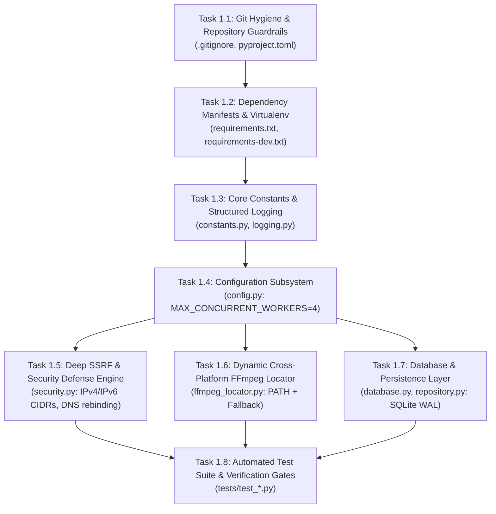

# 🛠️ PHASE 1 IMPLEMENTATION PLAN: FOUNDATION, ENVIRONMENT & SECURITY HARDENING
**Project:** Auralis — Modern Production-Grade Music Downloader  
**Phase:** Phase 1 of 5  
**Status:** Ready for Review (Implementation Frozen Until Approval)  
**Execution Guardrail:** Do not modify existing application files. Do not install dependencies until explicitly instructed.  

---

## 1. Phase 1 Objective & Scope

The objective of Phase 1 is to establish the **rock-solid foundation, security perimeter, cross-platform utilities, and persistence layer** for the Auralis platform *alongside* the existing prototype without disrupting any existing files.

```
┌──────────────────────────────────────────────────────────────────┐
│                      PHASE 1 SCOPE BOUNDARIES                    │
├───────────────────────────────┬──────────────────────────────────┤
│ IN SCOPE (Phase 1)            │ OUT OF SCOPE (Deferred to P2-P5) │
├───────────────────────────────┼──────────────────────────────────┤
│ • Git hygiene & .gitignore    │ • Asynchronous download engine   │
│ • Dependency specifications   │ • Progress hooks & cancellation  │
│ • Core configuration & logging│ • REST API routes (/jobs, etc.)  │
│ • Deep multi-layer SSRF Guard │ • Server-Sent Events (SSE)       │
│ • Dynamic FFmpeg resolution   │ • Modern Glassmorphic Web UI     │
│ • SQLite persistence & WAL    │ • Mutagen ID3 tagging & ZIPs     │
│ • Automated Phase 1 test suite│ • Legacy file deletion/migration │
└───────────────────────────────┴──────────────────────────────────┘
```

---

## 2. File Status Matrix

### Files to Preserve (DO NOT MODIFY OR DELETE)
The existing prototype files must remain completely intact and untouched to guarantee zero downtime and zero regression risk:

| File Path | Purpose | Preservation Action |
| :--- | :--- | :--- |
| `app.py` | Existing Flask prototype entrypoint | **Strictly preserve.** Must remain callable as-is. |
| `music_fixer.py` | Existing standalone CLI script | **Strictly preserve.** Do not alter or delete. |
| `templates/index.html` | Existing prototype web template | **Strictly preserve.** Unchanged during Phase 1. |
| `ffmpeg.exe` | Bundled Windows FFmpeg binary | **Preserve in root as fallback** for local execution while locator is initialized. |
| `downloads/` | Existing downloads directory | **Preserve.** |

### Files to Modify
**NONE.** No existing file will be modified during Phase 1.

### Files to Create
All Phase 1 deliverables are net-new files structured within a clean package hierarchy:

```
e:\MUSIC DOWNLODER\
│
├── .gitignore                    # Comprehensive version control ignore rules
├── pyproject.toml                # Project metadata, pytest & ruff tool configuration
├── requirements.txt              # Pinned core production runtime dependencies
├── requirements-dev.txt          # Pinned development, linting, and testing dependencies
│
├── app\                          # Application root package
│   ├── __init__.py               # Package initializer
│   │
│   ├── core\                     # Core configuration, constants, security & logging
│   │   ├── __init__.py
│   │   ├── config.py             # Settings (Pydantic BaseSettings, MAX_CONCURRENT_WORKERS=4)
│   │   ├── constants.py          # Audio semantics, format enums, job statuses, error codes
│   │   ├── logging.py            # Structured logger setup
│   │   └── security.py           # Deep SSRF guard, CIDR blacklists, DNS rebinding & redirect checker
│   │
│   ├── db\                       # SQLite persistence layer
│   │   ├── __init__.py
│   │   ├── database.py           # Connection factory, WAL configuration, transactional manager
│   │   └── repository.py         # Schema migration DDL, index creation, job/track CRUD
│   │
│   └── engine\                   # Core system engines
│       ├── __init__.py
│       └── ffmpeg_locator.py     # Cross-platform dynamic FFmpeg resolution & validation
│
└── tests\                        # Automated test suite
    ├── __init__.py
    ├── conftest.py               # Test fixtures (temp paths, test database, mock URLs)
    ├── test_security.py          # Deep SSRF, CIDR ranges, DNS rebinding, redirect tests
    ├── test_ffmpeg_locator.py    # FFmpeg path resolution & version check tests
    └── test_database.py          # SQLite WAL, schema initialization & CRUD tests
```

---

## 3. Pinned Dependency Specifications

### Runtime Dependencies (`requirements.txt`)
```text
fastapi==0.115.0
uvicorn[standard]==0.31.0
pydantic==2.9.2
pydantic-settings==2.5.2
yt-dlp==2024.9.27
mutagen==1.47.0
python-multipart==0.0.12
```

### Development & Testing Dependencies (`requirements-dev.txt`)
```text
pytest==8.3.3
pytest-asyncio==0.24.0
httpx==0.27.2
ruff==0.6.8
```

---

## 4. Phase 1 Implementation Tasks in Dependency Order



### Task 1.1: Git Hygiene & Repository Guardrails
- **Files to Create:** `.gitignore`, `pyproject.toml`
- **Actions:**
  - Create `.gitignore` ignoring:
    - Python virtual environments (`.venv/`, `venv/`, `env/`)
    - Bytecode & caches (`__pycache__/`, `*.pyc`, `*.pyo`)
    - Test & coverage artifacts (`.pytest_cache/`, `.coverage`, `htmlcov/`)
    - Local data directories (`data/temp/`, `data/completed/`, `data/*.db`)
    - OS metadata (`Thumbs.db`, `.DS_Store`, `desktop.ini`)
    - Executable binaries (`ffmpeg.exe`, `ffprobe.exe`)
  - Create `pyproject.toml` configuring:
    - Python 3.12 target version
    - Ruff linting rules (enforcing PEP 8, import sorting, bugbear checks)
    - Pytest settings (asyncio mode, test discovery in `tests/`)

### Task 1.2: Dependency Manifests & Virtualenv Bootstrap
- **Files to Create:** `requirements.txt`, `requirements-dev.txt`
- **Actions:**
  - Write explicit pinned versions for runtime and dev dependencies.
  - Document setup commands in README / plan.

### Task 1.3: Core Constants & Structured Logging
- **Files to Create:** `app/core/constants.py`, `app/core/logging.py`, `app/__init__.py`, `app/core/__init__.py`
- **Actions:**
  - Define `AudioFormat` enum:
    - `NATIVE_OPUS` ("Direct Stream Copy - Opus")
    - `NATIVE_M4A` ("Direct Stream Copy - M4A/AAC")
    - `MP3_320` ("Transcoded MP3 - 320 kbps (High Compatibility)")
    - `MP3_256` ("Transcoded MP3 - 256 kbps")
    - `MP3_VBR` ("Transcoded MP3 - VBR V0")
    - `FLAC` ("Transcoded FLAC - Lossless Container")
  - Define `JobStatus` enum: `QUEUED`, `FETCHING_METADATA`, `DOWNLOADING`, `CONVERTING`, `COMPLETED`, `FAILED`, `CANCELLED`, `EXPIRED`.
  - Define standard error codes: `INVALID_URL`, `SSRF_VIOLATION`, `JOB_NOT_FOUND`, `STORAGE_LIMIT_EXCEEDED`, `EXTRACTION_FAILED`.
  - Set up standard `logging.config.dictConfig` with formatted console output.

### Task 1.4: Configuration Subsystem (`app/core/config.py`)
- **Files to Create:** `app/core/config.py`
- **Actions:**
  - Define `Settings` class using `pydantic_settings.BaseSettings`:
    - `MAX_CONCURRENT_WORKERS: int = 4` (conservative default, overridable via `.env`)
    - `JOB_TTL_MINUTES: int = 60` (ephemeral storage expiration threshold)
    - `MAX_PLAYLIST_ITEMS: int = 100` (anti-DoS ceiling)
    - `DISK_FREE_THRESHOLD_MB: int = 2048` (storage safety buffer)
    - `TEMP_DIR: Path = Path("data/temp")`
    - `COMPLETED_DIR: Path = Path("data/completed")`
    - `DB_PATH: Path = Path("data/auralis.db")`
    - `RATE_LIMIT_PER_MINUTE: int = 10`
    - `ALLOWED_ORIGINS: list[str] = ["*"]`
  - Ensure all directories (`data/temp`, `data/completed`) are created safely on initialization.

### Task 1.5: Deep SSRF & Security Defense Engine (`app/core/security.py`)
- **Files to Create:** `app/core/security.py`
- **Actions:**
  Implement the comprehensive multi-layered SSRF & URL defense:
  1. **Protocol Sanitization:** Verify scheme is strictly `http` or `https`.
  2. **IP Literal & Representation Rejection:** Reject raw IP inputs, octal formats (`0177.0.0.1`), hex (`0x7f000001`), dword (`2130706433`), and bracketed IPv6 literals (`[::1]`).
  3. **Localhost & Internal Domain Blacklist:** Reject `localhost`, `*.local`, `*.internal`, `*.lan`, `*.home`, `*.corp`.
  4. **Pre-Flight DNS Resolution:** Use `socket.getaddrinfo()` to resolve the hostname to all associated IPv4 and IPv6 addresses before connecting.
  5. **Deep CIDR Blacklist Evaluation:** Check every resolved IP against:
     - `127.0.0.0/8` (IPv4 Loopback)
     - `10.0.0.0/8`, `172.16.0.0/12`, `192.168.0.0/16` (IPv4 Private RFC1918)
     - `169.254.0.0/16` (IPv4 Link-Local / Cloud Metadata)
     - `100.64.0.0/10` (IPv4 Carrier-Grade NAT)
     - `0.0.0.0/8`, `224.0.0.0/4`, `255.255.255.255/32` (Broadcast / Multicast)
     - `::1/128` (IPv6 Loopback)
     - `fc00::/7` (IPv6 Unique Local Address - ULA)
     - `fe80::/10` (IPv6 Link-Local)
     - `fec0::/10` (IPv6 Site-Local)
     - `::ffff:0:0/96` (IPv4-mapped IPv6)
     - `::/128`, `ff00::/8` (IPv6 Unspecified / Multicast)
  6. **DNS Rebinding & TOCTOU Defense:** Provide IP-pinning utility so outbound requests connect directly to the pre-validated IP while sending the original hostname in HTTP `Host` and TLS SNI headers.
  7. **Redirect Interceptor & Re-Validator:** Intercept all `3xx` redirects, inspect target `Location` URLs through steps 1–5, and abort if any hop resolves to an internal address (max 3 hops).

### Task 1.6: Dynamic Cross-Platform FFmpeg Locator (`app/engine/ffmpeg_locator.py`)
- **Files to Create:** `app/engine/__init__.py`, `app/engine/ffmpeg_locator.py`
- **Actions:**
  - Build `get_ffmpeg_path()` using fallback resolution order:
    1. Explicit path in `config.FFMPEG_PATH` or environment variable `FFMPEG_PATH`.
    2. System PATH discovery via `shutil.which("ffmpeg")`.
    3. Root folder fallback (`./ffmpeg.exe`) during migration.
    4. Local `vendor/ffmpeg/` directory.
  - Implement `verify_ffmpeg(path: str) -> tuple[bool, str]`:
    - Executes `<path> -version` with a 3-second timeout.
    - Parses version string (e.g. `ffmpeg version 6.1`).
    - Raises descriptive `FFmpegNotFoundException` with setup guidance if missing.

### Task 1.7: Database & Persistence Layer (`app/db/`)
- **Files to Create:** `app/db/__init__.py`, `app/db/database.py`, `app/db/repository.py`
- **Actions:**
  - In `database.py`:
    - Create SQLite connection context manager.
    - Enable `PRAGMA journal_mode = WAL;` (Write-Ahead Logging for high-concurrency non-blocking reads).
    - Enable `PRAGMA synchronous = NORMAL;`.
    - Enable `PRAGMA foreign_keys = ON;`.
    - Enable `PRAGMA busy_timeout = 5000;`.
  - In `repository.py`:
    - Implement `init_db()` to execute idempotent table creation:
      - `jobs`: `id` (TEXT PK), `url` (TEXT), `title` (TEXT), `format` (TEXT), `quality` (TEXT), `status` (TEXT), `progress` (INTEGER), `speed` (REAL), `eta` (INTEGER), `file_path` (TEXT), `file_size` (INTEGER), `error_message` (TEXT), `created_at` (TIMESTAMP), `completed_at` (TIMESTAMP), `expires_at` (TIMESTAMP).
      - `tracks`: `id` (INTEGER PK AUTOINCREMENT), `job_id` (TEXT FK), `track_index` (INTEGER), `track_title` (TEXT), `duration` (INTEGER), `status` (TEXT).
      - Indexes on `jobs.status`, `jobs.created_at`, `jobs.expires_at`, and `tracks.job_id`.
    - Implement Phase 1 sanity CRUD functions (`create_job`, `get_job`, `update_job_status`).

### Task 1.8: Automated Test Suite & Verification Gates
- **Files to Create:** `tests/__init__.py`, `tests/conftest.py`, `tests/test_security.py`, `tests/test_ffmpeg_locator.py`, `tests/test_database.py`
- **Actions:**
  - `test_security.py`:
    - Verify acceptance of legitimate YouTube and YouTube Music URLs.
    - Verify rejection of IPv4 loopback (`127.0.0.1`, `127.0.0.2`, `127.255.255.254`).
    - Verify rejection of IPv4 private ranges (`10.0.0.1`, `172.16.0.1`, `192.168.1.1`).
    - Verify rejection of IPv4 link-local / cloud metadata (`169.254.169.254`).
    - Verify rejection of Carrier-Grade NAT (`100.64.0.1`).
    - Verify rejection of IPv6 loopback (`::1`, `[::1]`).
    - Verify rejection of IPv6 ULA & link-local (`fc00::1`, `fe80::1`).
    - Verify rejection of IPv4-mapped IPv6 (`::ffff:127.0.0.1`).
    - Verify rejection of obfuscated IP literals (hex `0x7f000001`, octal `0177.0.0.1`, dword `2130706433`).
    - Verify rejection of internal hostnames (`localhost`, `metadata.internal`, `router.local`).
    - Verify rejection of redirect chains leading to private/loopback destinations.
  - `test_ffmpeg_locator.py`:
    - Verify resolution of the existing local `ffmpeg.exe`.
    - Verify version detection and command execution.
    - Verify proper exception handling when path is invalid.
  - `test_database.py`:
    - Verify database file creation and WAL journal mode enablement.
    - Verify table and index creation.
    - Verify transactional insertion, retrieval, and status updates for jobs and tracks.
    - Verify foreign key cascade enforcement.

---

## 5. Acceptance Criteria & Verification Gates

Before Phase 1 is certified as complete, the following gates must pass:

| Gate ID | Verification Item | Pass Criteria |
| :--- | :--- | :--- |
| **GATE-1** | **Preservation of Existing Code** | `app.py`, `music_fixer.py`, `templates/index.html`, and `ffmpeg.exe` remain byte-for-byte identical to their pre-Phase 1 state. |
| **GATE-2** | **SSRF Defense Verification** | All test cases in `test_security.py` pass; zero false-negatives on loopback, private ranges, link-local, IPv6, obfuscated IP formats, and redirect traps. |
| **GATE-3** | **FFmpeg Resolution** | `get_ffmpeg_path()` discovers and validates the local FFmpeg binary, returning version ≥ 6.0 without hardcoded absolute paths. |
| **GATE-4** | **SQLite WAL Initialization** | `init_db()` executes without errors; `PRAGMA journal_mode` returns `wal`; tables `jobs` and `tracks` exist with indexes. |
| **GATE-5** | **Configurable Concurrency** | `Settings.MAX_CONCURRENT_WORKERS` defaults to `4` and correctly reads environment overrides. |
| **GATE-6** | **Full Automated Test Pass** | Running `pytest tests/` produces 100% passing tests with zero errors or unhandled warnings. |

---

## 6. Rollback Strategy

Because Phase 1 does **not modify any existing files**, rollback is straightforward, instantaneous, and non-destructive:

```powershell
# Rollback Procedure (if ever required)
Remove-Item -Recurse -Force "app\"
Remove-Item -Recurse -Force "tests\"
Remove-Item -Force ".gitignore", "pyproject.toml", "requirements.txt", "requirements-dev.txt"
if (Test-Path "data\auralis.db") { Remove-Item -Force "data\auralis.db*" }
```

Following this procedure restores the workspace to its exact starting state without loss of data or functionality.

---

*Phase 1 Implementation Plan certified by Antigravity Engineering Architecture Team. Awaiting user approval before execution.*
