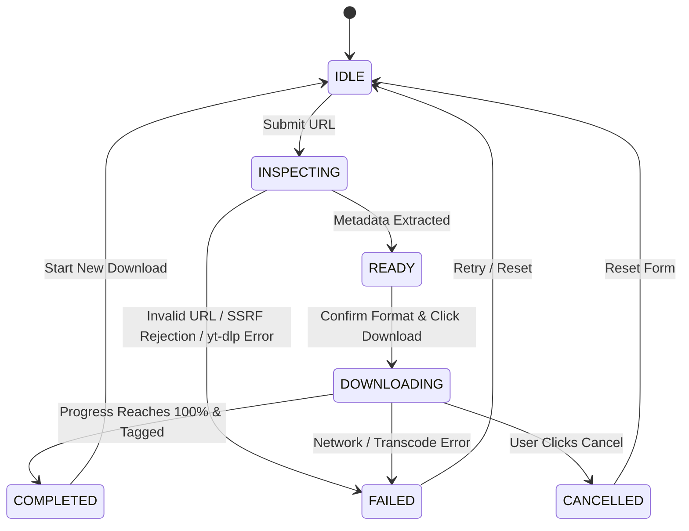

# 🎵 PHASE 3 IMPLEMENTATION PLAN: SONORA FRONTEND & PRODUCT BUILD

**Project Name:** SONORA
**Product Category:** Modern Music Downloader
**Phase:** Phase 3 — Frontend + Product Build
**Status:** Plan Proposed (Awaiting Review & Approval)
**Target Stack:** Python 3.12, FastAPI, SQLite (WAL), ThreadPoolExecutor, yt-dlp, FFmpeg, Mutagen, SSE, HTML5/CSS3/Vanilla JS
**Architecture Guardrail:** The repaired Phase 1/2 backend foundation is protected. Do not rewrite backend core logic. Preserve legacy prototype files (`app.py`, `music_fixer.py`, `templates/index.html`, `ffmpeg.exe`).

---

## 1. Product Identity & Visual Direction

### 1.1 Branding & Copy
- **Product Name:** SONORA
- **Tagline:** YOUR MUSIC. EVERYWHERE.
- **Hero Sub-Headline:** Paste. Download. Listen.
- **Supporting Copy:** Fast, clean and free music downloader.
- **Scope Rule:** Apply SONORA branding consistently across page titles, logo, navigation, startup animation, metadata cards, notifications, footer, and documentation. Eliminate legacy prototype names (Auralis/TuneGrab) from user-facing copy.

### 1.2 Swiss-Inspired Visual System
- **Base Theme (Light):** Warm off-white / light neutral background (`#F9F8F6`), near-black / charcoal text (`#121212`), pure white elevated surfaces (`#FFFFFF`), subtle neutral borders (`#E5E3DF`), dark control buttons (`#1E1E1E`), subtle violet/indigo accent (`#6366F1`).
- **Dark Theme:** Charcoal background (`#121212`), elevated card surfaces (`#1E1E1E`), muted borders (`#2E2E2E`), soft white text (`#F3F4F6`), subtle violet accent (`#818CF8`).
- **Typography:** High-impact editorial headline typography, clean modern sans-serif body, generous line height, clear hierarchy.
- **Iconography:** Consistent stroke-based icon system (Lucide icons loaded via SVG).
- **Prohibited Aesthetics:** No heavy glassmorphism, no neon cyberpunk gradients, no 3D objects, no particle spam, no noisy layout clutter.

---

## 2. File & Component Architecture

To maintain complete backward compatibility and satisfy `tests/test_preservation.py`, all new Phase 3 components reside cleanly in `app/main.py`, `app/api/`, and `app/static/`:

```
e:\MUSIC DOWNLODER\
├── app/
│   ├── main.py                     # [NEW] FastAPI web server entrypoint & static route mounting
│   ├── api/
│   │   ├── __init__.py             # [NEW] API package initializer
│   │   └── v1/
│   │       ├── __init__.py         # [NEW] API v1 package initializer
│   │       └── endpoints.py        # [NEW] REST & SSE Endpoints (/metadata, /jobs, /cancel, /events, /downloads)
│   └── static/                     # [NEW] SONORA Web Application Frontend Assets
│       ├── index.html              # [NEW] Complete SONORA single-page app HTML
│       ├── css/
│       │   └── styles.css          # [NEW] Design system variables, layout, animations, responsive rules
│       └── js/
│           ├── app.js              # [NEW] State machine manager, API client, SSE handler, playlist logic
│           └── icons.js            # [NEW] Lucide SVG icon helper
└── tests/
    └── test_api.py                 # [NEW] FastAPI API & SSE endpoint automated integration tests
```

### Legacy Preservation Matrix (DO NOT MODIFY OR DELETE)
| Legacy File | Reason for Preservation |
| :--- | :--- |
| `app.py` | Enforced by `tests/test_preservation.py` SHA256 integrity check. |
| `music_fixer.py` | Enforced by `tests/test_preservation.py` SHA256 integrity check. |
| `templates/index.html` | Enforced by `tests/test_preservation.py` SHA256 integrity check. |
| `ffmpeg.exe` | Enforced by `tests/test_preservation.py` SHA256 integrity check. |
| `downloads/` | Enforced directory structure check. |

---

## 3. Backend API Contract & Endpoints (`app/api/v1/endpoints.py`)

The Phase 3 FastAPI application in `app/main.py` mounts the following endpoints:

| Endpoint | Method | Input Schema | Purpose / Backend Service |
| :--- | :--- | :--- | :--- |
| `POST /api/v1/metadata` | `POST` | `{"url": "str", "is_playlist": bool}` | Calls `MetadataService.extract_metadata()`. Performs pre-flight SSRF check & returns normalized tracklist metadata. |
| `POST /api/v1/jobs` | `POST` | `{"url": "str", "format": "str", "quality": "str", "is_playlist": bool, "selected_indices": [int], "title": "str"}` | Calls `JobManager.submit_job()`. Enforces rate limits & playlist quotas. Returns `{"job_id": "...", "status": "queued"}`. |
| `GET /api/v1/jobs/{id}` | `GET` | `job_id` path param | Queries SQLite via `repository.get_job()`. Returns current status, progress, speed, ETA, error message. |
| `POST /api/v1/jobs/{id}/cancel` | `POST` | `job_id` path param | Calls `JobManager.cancel_job()`. Signals cooperative cancel token. Returns `{"job_id": "...", "status": "cancelled"}`. |
| `GET /api/v1/jobs/{id}/events` | `GET` | `job_id` path param | **Server-Sent Events (SSE)** stream. Listens to `JobContext` progress events and streams JSON events to browser. |
| `GET /api/v1/downloads/{id}/file` | `GET` | `job_id` path param | Serves completed track audio or playlist zip archive using FastAPI `FileResponse` with safe `Content-Disposition` attachment headers. |
| `GET /` | `GET` | None | Serves `app/static/index.html` (SONORA main landing page & app). |

---

## 4. Frontend State Machine & Interaction Design

The SONORA web app operates on a strict, explicit state machine in `app.js`:



### Detailed UI State Behaviors

1. **`IDLE` State:**
   - Display: Main landing page, hero section, URL input bar (`[ link icon ] Paste music or video link here... [ X ] [ Download ]`).
   - Controls: Format selector buttons (MP3 320/256/VBR, Native M4A, Native Opus, FLAC) with honest quality labels.
   - Behavior: Clear button clears input; paste button reads clipboard if permitted.

2. **`INSPECTING` State:**
   - Display: URL input card morphs into loading state with subtle animated spinner and skeleton pulse.
   - Behavior: Disables input and submit buttons while calling `POST /api/v1/metadata`.

3. **`READY` State:**
   - Display: Metadata card reveals artwork, track title, artist/uploader, duration, platform source.
   - Single Track: Shows track details and format selection confirmation.
   - Playlist: Reveals playlist banner, track list checklist with checkboxes (`☑ Track 01`, `☑ Track 02`), `[ Select All ]` button, selected track counter (`X tracks selected`), and `[ Download Playlist ]` CTA.

4. **`DOWNLOADING` State:**
   - Display: Real progress card showing track/playlist cover artwork, active track title, aggregate composite progress bar, percentage (`0–100%`), download speed (`MB/s`), estimated time remaining (`ETA`), status indicator, and prominent `[ Cancel ]` button.
   - SSE Integration: Connects to `EventSource('/api/v1/jobs/{id}/events')`. Receives real-time telemetry from worker thread without polling. Fallbacks to short polling (2s) only if SSE drops.

5. **`COMPLETED` State:**
   - Display: Victory state card with cover artwork, track title, final file size, audio format tag, completed badge, primary `[ Download File ]` button (triggers browser file download), and `[ Download Another ]` secondary CTA.

6. **`FAILED` State:**
   - Display: Clean, human-readable error notification card.
   - Security Enforcement: Strips all internal Windows filesystem paths (`E:\...`), raw Python tracebacks, and database errors. Displays user-actionable instructions with a `[ Try Again ]` button.

7. **`CANCELLED` State:**
   - Display: Cancellation notice card stating download was cancelled safely. `[ Start New Download ]` button resets interface to `IDLE`.

---

## 5. Startup Animation Architecture

- **Visual Concept:**
  1. Application launches with warm off-white / light neutral screen (`#F9F8F6`).
  2. Subtle SVG sound-wave / acoustic cord lines gently expand and pulse behind the center viewport.
  3. The **SONORA** wordmark reveals smoothly in editorial typography in the center.
  4. Subtitle **MUSIC DOWNLOADER** fades in below the wordmark.
  5. The acoustic waveform gently animates around the wordmark and transitions seamlessly into the landing page.
- **Timing:** 0.8–1.2 seconds total duration. Fast, subtle, elegant.
- **Accessibility:** Fully supports `@media (prefers-reduced-motion: reduce)`. When reduced motion is preferred, the animation bypasses keyframes and performs an instant/minimal fade reveal.

---

## 6. Responsive Mobile & Desktop Layout

- **Desktop (1024px+):** Generous breathing room, side-by-side hero text and downloader visual card, centered max-width (1200px) grid layouts.
- **Tablet (768px - 1023px):** Stacked hero section, fluid input controls, full-width action cards.
- **Mobile (375px - 767px):** Mobile-first single-column layout, touch-friendly buttons (minimum 44x44px touch targets), horizontal scroll prevention, collapsible slide-out navigation drawer.

---

## 7. 10-Milestone Execution Breakdown

### MILESTONE 1: Frontend Foundation + SONORA Design System
- Create `app/main.py`, `app/api/v1/endpoints.py`, `app/static/index.html`, `app/static/css/styles.css`.
- Define CSS custom properties for light/dark themes, Swiss typography scale, border styles, and layout grid.
- **Verification:** Start FastAPI server via Uvicorn and verify root `/` serves static structure.

### MILESTONE 2: SONORA Startup Animation
- Build `#startup-overlay` HTML structure, SVG acoustic cord waveform visuals, CSS keyframes, and reduced-motion media query.
- **Verification:** Test animation lifecycle in browser; verify reduced-motion bypass.

### MILESTONE 3: Complete Landing Page
- Build complete SONORA landing page: Navigation bar, Hero section, Platform badges, Features section, Supported Sites grid, FAQ accordion, Footer, Light/Dark theme switcher with `localStorage` persistence.
- **Verification:** Visual review in both light and dark modes.

### MILESTONE 4: Metadata Inspection + Downloader Interaction
- Wire `POST /api/v1/metadata` endpoint.
- Build URL input bar interaction in `app.js` (`IDLE` -> `INSPECTING` -> `READY`).
- Format selector UI with quality labels and acoustic tooltips.
- **Verification:** Test metadata extraction for single YouTube URLs and playlists.

### MILESTONE 5: Real Download Integration + Progress
- Wire `POST /api/v1/jobs` submission, `GET /api/v1/jobs/{id}`, and `GET /api/v1/jobs/{id}/events` SSE stream.
- Connect `DOWNLOADING` state to live `EventSource` updates (progress %, speed, ETA, status).
- **Verification:** Real single-track download with live progress stream.

### MILESTONE 6: Playlist + Queue Experience
- Add playlist track checklist, "Select All" toggle, selected count badge in `READY` view.
- Pass `selected_indices` to `/api/v1/jobs`.
- Render aggregate composite progress bar `(completed * 100 + current) / total`.
- **Verification:** Real multi-track playlist download & ZIP archive creation.

### MILESTONE 7: Completion / Failure / Cancellation Flows
- Wire `GET /api/v1/downloads/{id}/file` delivery endpoint with safe attachment headers.
- Wire `POST /api/v1/jobs/{id}/cancel` endpoint and UI button.
- Build `COMPLETED`, `FAILED`, and `CANCELLED` UI state cards with error sanitization.
- **Verification:** File download trigger, job cancellation test, sanitized error handling test.

### MILESTONE 8: Responsive Mobile + Desktop Polish
- Optimize layout for 375px mobile viewports, touch targets, and desktop displays.
- Eliminate horizontal scrolling and overflow issues.
- **Verification:** Viewport responsiveness testing across 375px, 768px, and 1280px.

### MILESTONE 9: Accessibility + Performance + Browser QA
- Ensure keyboard focus rings (`:focus-visible`), ARIA attributes, semantic HTML tags.
- Perform end-to-end browser automation testing (Playwright / Chrome DevTools).
- **Verification:** 100% test pass rate in automated test suite and clean browser run.

### MILESTONE 10: Final Production Verification + Release Documentation
- Run full test suite (`pytest`) and Ruff linter.
- Update project memory files (`PLAN.md`, `STATE.md`, `TASKS.md`, `CHANGELOG.md`, `REPORT.md`).
- Document final release verification.
- **Verification:** All existing 77 tests + new API tests pass; zero linter errors.

---

## 8. Acceptance Criteria & Quality Gates

| Gate ID | Verification Item | Pass Criteria |
| :--- | :--- | :--- |
| **GATE-1** | **Branding Consistency** | Product name "SONORA" is displayed consistently across title, branding, startup animation, hero, and footer. Zero "Auralis/TuneGrab" user-facing leakage. |
| **GATE-2** | **Startup Animation** | Plays smooth acoustic waveform animation in ~0.8–1.2s; respects `prefers-reduced-motion`. |
| **GATE-3** | **Real Metadata Inspection** | `POST /api/v1/metadata` validates URL via SSRF guard and returns title, uploader, thumbnail, duration, track list. |
| **GATE-4** | **Real Single & Playlist Downloads** | End-to-end execution of single-track and multi-track playlist downloads with real yt-dlp / FFmpeg processing. |
| **GATE-5** | **Real-Time SSE Progress** | `GET /api/v1/jobs/{id}/events` streams real-time progress %, speed, ETA, and current track title to browser. |
| **GATE-6** | **Cancellation Safety** | Clicking cancel aborts worker download and transitions job state to `CANCELLED` without Windows file lock errors (`[WinError 32]`). |
| **GATE-7** | **File Delivery** | `GET /api/v1/downloads/{id}/file` serves completed audio file or zip archive with correct `Content-Disposition`. |
| **GATE-8** | **Preservation Guarantee** | All 4 legacy files (`app.py`, `music_fixer.py`, `templates/index.html`, `ffmpeg.exe`) remain untouched; `test_preservation.py` passes 100%. |
| **GATE-9** | **Full Automated Test Pass** | All 77 baseline unit/integration tests + new API tests pass cleanly in `pytest`. Ruff linter reports 0 errors. |

---

## 9. Git Checkpoint Discipline

At each completed milestone:
1. Run `pytest` and `ruff check .`.
2. Perform browser verification.
3. Review `git status` and `git diff`.
4. Report milestone results to user.
5. Ask: *"Milestone X completed and verified. Git changes are ready. Do you want me to commit and push this milestone to GitHub?"*
6. **WAIT** for explicit approval before creating any git commit or push.
