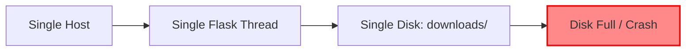
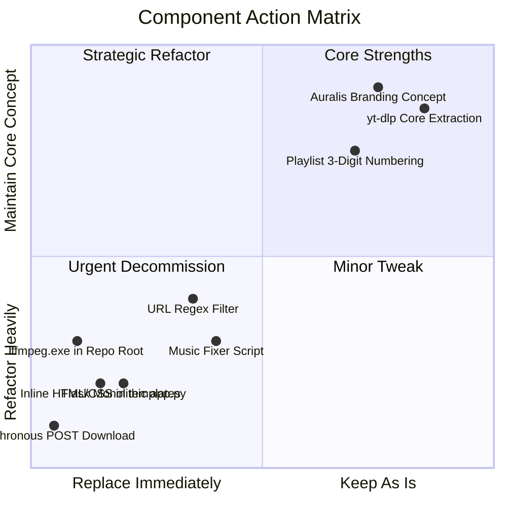
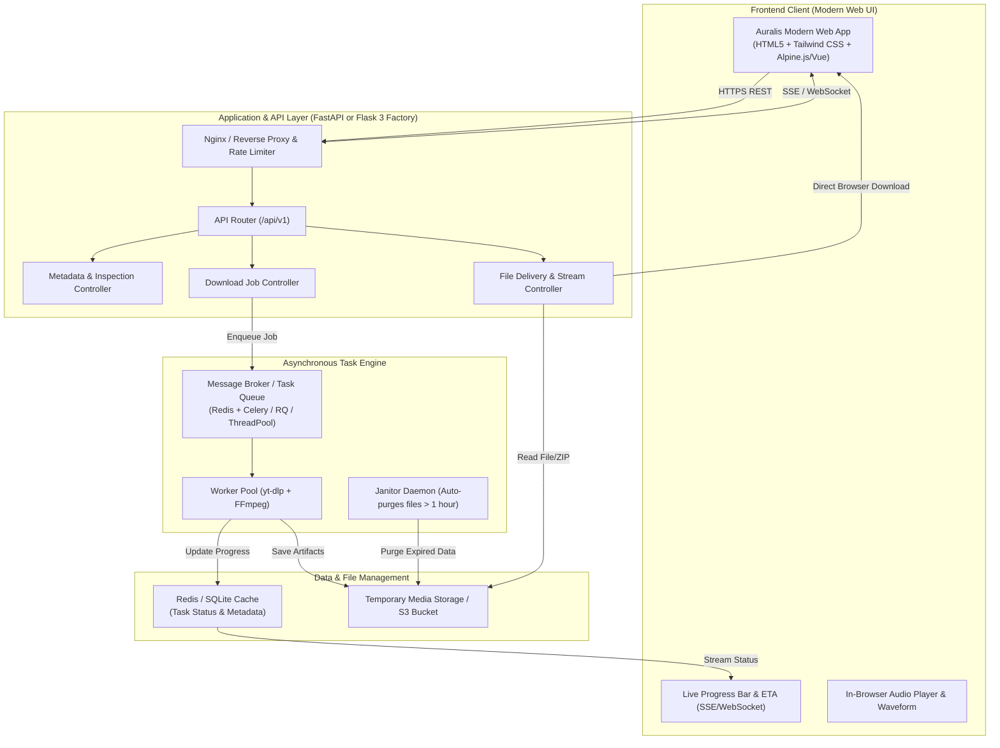

# 📋 COMPREHENSIVE PROJECT AUDIT REPORT
**Project Name:** Auralis (Music Downloader)  
**Project Path:** `e:\MUSIC DOWNLODER`  
**Audit Date:** September 21, 2026  
**Auditor:** Antigravity Engineering Architecture Team  
**Status:** Pre-Refactor Discovery & Deep Technical Analysis  

---

## Executive Summary

The project **Auralis** is a lightweight web application intended to download music and playlists from YouTube / YouTube Music, extract audio, convert tracks to high-bitrate MP3s, tag them with metadata and artwork, and format them with 3-digit indexing (`001 - Title.mp3`).

While the application demonstrates a functional proof-of-concept for invoking `yt-dlp` and `ffmpeg`, it is currently in a **fragile, non-production-ready prototype state**. Crucially:
1. **The downloaded files are never delivered to the user's browser**; they are saved exclusively to the host server's local hard drive.
2. **Download operations execute synchronously within the HTTP request cycle**, freezing the server thread and guaranteeing browser/gateway timeouts on any playlist with more than 1–2 tracks.
3. **There is no asynchronous task queue, no database, no state persistence, no API, no security hardening, and no responsive UI.**
4. **A 128 MB Windows binary (`ffmpeg.exe`) is committed directly into the project root**, preventing cross-platform compatibility and bloating storage.

This report provides a forensic analysis of the current architecture, technical debt, vulnerabilities, and limitations, followed by a production-grade blueprint and phased execution roadmap.

---

## 1. Current Project Architecture

### High-Level Architecture Diagram

```mermaid
flowchart TD
    subgraph Client["Client Browser"]
        UI["templates/index.html\n(Vanilla HTML/Inline CSS)"]
        Form["HTML Form (POST /download)"]
    end

    subgraph Server["Flask Monolith (app.py)"]
        FlaskRouter["Flask HTTP Handler\n(@app.route('/download'))"]
        RegexValidator["URL Regex Validation\n(is_valid_link)"]
        YTDLP["yt-dlp Engine\n(Synchronous In-Thread Execution)"]
    end

    subgraph HostSystem["Host Operating System"]
        FFMPEG["Bundled ffmpeg.exe (128MB Win64)"]
        Disk["Local Storage: downloads/"]
    end

    subgraph External["External Services"]
        YT["YouTube / YouTube Music CDN"]
        WallpaperCDN["getwallpapers.com (Unsecured Asset)"]
    end

    UI -->|Static Load| WallpaperCDN
    UI --> Form
    Form -->|Synchronous POST\n(Browser blocks)| FlaskRouter
    FlaskRouter --> RegexValidator
    RegexValidator -->|Valid| YTDLP
    YTDLP -->|Fetch Audio Stream| YT
    YTDLP -->|Invoke Subprocess| FFMPEG
    FFMPEG -->|Write MP3 Files| Disk
    FlaskRouter -->|Return Raw HTML String\nFiles stay on host!| UI
```

### Key Architectural Characteristics
- **Monolithic Synchronous Request Cycle:** The Flask request thread directly blocks on `ydl.download([url])`. No background worker, async loop, or task queue is employed.
- **Tightly Coupled Infrastructure:** Audio extraction, encoding, metadata tagging, filesystem writes, and web routing are compressed into a single 53-line script (`app.py`).
- **No Client File Transmission:** The server processes media and saves it to `./downloads/`, but returns a static HTML success message without providing a file download link, stream, or ZIP archive.
- **Orphaned Scripts:** A second script, `music_fixer.py`, exists in isolation with a hardcoded playlist link and alternate directory structure (`MyMusic/%(uploader)s/%(album)s/...`), completely disconnected from the web interface.

---

## 2. Complete Folder & File Structure

### Current Filesystem Layout
```
e:\MUSIC DOWNLODER\
│
├── app.py                     # Primary Flask web application (53 lines, 1.7 KB)
├── music_fixer.py             # Standalone CLI downloader script (25 lines, 881 B)
├── ffmpeg.exe                 # Static Windows FFmpeg binary 6.1 (134.1 MB)
├── downloads\                 # Target storage directory for downloaded MP3s (Empty)
│
└── templates\
    └── index.html             # Jinja2 landing page template with inline CSS (103 lines, 2.6 KB)
```

### Critical Missing Files & Directories
| Missing File/Directory | Importance | Impact of Absence |
| :--- | :--- | :--- |
| `.git/`, `.gitignore` | Critical | No version control; massive 128 MB binary tracked; cannot branch or collaborate safely. |
| `requirements.txt` / `pyproject.toml` | Critical | No dependency declarations; environment cannot be reproduced reliably. |
| `.env`, `.env.example` | High | Hardcoded configuration; no environment-variable abstraction for ports, paths, or keys. |
| `static/` (`css/`, `js/`, `assets/`) | High | No separate asset pipeline; CSS is inline; wallpaper is hotlinked from third party; no JS exists. |
| `tests/` (`test_downloader.py`, etc.) | High | Zero test coverage; regex and download options cannot be automatically validated. |
| `Dockerfile`, `docker-compose.yml` | Medium | Inability to deploy as a containerized microservice; tied strictly to Windows x64. |
| `README.md` | Medium | No setup instructions, prerequisite guides, or system documentation. |

---

## 3. Frontend Technologies & Implementation

### Current Stack
- **HTML5:** Basic structural markup without semantic tags (`<header>`, `<main>`, `<section>`).
- **CSS:** Inline `<style>` block in `templates/index.html`.
- **JavaScript:** **None.** Zero client-side logic.

### Frontend Technical Findings
1. **Synchronous Blocking UX:** Submitting the download form triggers a standard native browser POST request. The browser tab enters an indefinite loading spinner state. The user has no indication whether the server is working, stalled, or downloading.
2. **Third-Party Asset Hotlinking:** The background image is linked directly to an unverified external URL (`https://getwallpapers.com/wallpaper/full/7/a/b/754028-music-wallpapers-1920x1080-for-phones.jpg`). If the remote server goes down, imposes hotlink protection, or blocks the user's IP, the UI background breaks completely.
3. **Typography & Styling Clashes:** The page mixes a formal serif font (`font-family: 'Times New Roman', Times, serif;`) with modern glassmorphism (`backdrop-filter: blur(5px);`).
4. **Lack of Mobile Responsiveness:** The input field has a fixed width (`width: 400px;`) and title has a rigid font size (`font-size: 5rem;`) without viewport clamping (`clamp()`) or media queries, causing visual overflow on mobile screens.
5. **No Accessibility (a11y):** No `<label>` elements for inputs, missing `aria-*` tags, no keyboard navigation focus states, and low contrast ratios depending on wallpaper brightness.
6. **No Feedback Mechanism:** No toast notifications, error banners, progress bars, audio visualizers, or track listings.
7. **Unstyled Server Responses:** When an error or success occurs, the backend returns raw HTML strings (`<h1>❌ Invalid Link</h1>` or `<h1>✅ Auralis Success!</h1>`), throwing the user out of the themed UI entirely.

---

## 4. Backend Technologies & Implementation

### Current Stack
- **Framework:** Flask (Python) running via `app.run(debug=True, port=5000, threaded=True)`.
- **Extraction Engine:** `yt-dlp` (Python library).
- **Audio Processing:** Bundled static `ffmpeg.exe` (v6.1-full_build).

### Backend Code Review (`app.py` & `music_fixer.py`)

#### A. URL Validation Flaws
In `app.py`:
```python
def is_valid_link(url):
    youtube_regex = (
        r'(https?://)?(www\.|music\.)?(youtube|youtu|youtube-nocookie)\.(com|be)/'
        r'(watch\?v=|playlist\?list=|embed/|v/|.+\?v=|.+\?list=)?([^&=%\?]+)'
    )
    return re.match(youtube_regex, url) is not None
```
- **Flaw 1:** Rejects YouTube Shorts (`https://www.youtube.com/shorts/...`), mobile URLs (`m.youtube.com`), and various YouTube Music share links where query parameters precede the ID.
- **Flaw 2:** Artificially restricts the app to YouTube, even though `yt-dlp` supports SoundCloud, Bandcamp, Mixcloud, and hundreds of other audio sources.
- **Flaw 3:** Allows malformed parameters to slip through if the prefix matches.

#### B. Flawed FFmpeg Path Resolution
In `app.py`:
```python
'ffmpeg_location': './',
```
In `music_fixer.py`:
```python
base_dir = os.path.dirname(os.path.abspath(__file__))
'ffmpeg_location': base_dir,
```
- `'./'` refers to the **current working directory (CWD)** of the process, NOT the directory where `app.py` resides. If the application is launched from `C:\Users\...` or via a service manager, FFmpeg will not be found, causing downloads to fail abruptly.

#### C. Incompatible Filename Template
In `app.py`:
```python
'outtmpl': f'{DOWNLOAD_FOLDER}/%(playlist_index)03d - %(title)s.%(ext)s',
```
- When a user downloads a **single track** instead of a playlist, `playlist_index` evaluates to `NA`. The resulting file is saved as `NA - Title.mp3`, or throws an extraction warning/exception depending on `yt-dlp` options.

#### D. Lossy-to-Lossy Audio Transcoding
```python
{'key': 'FFmpegExtractAudio', 'preferredcodec': 'mp3', 'preferredquality': '320'}
```
- YouTube distributes audio streams encoded in **Opus (typically ~50–160 kbps)** or **AAC (~128–256 kbps)**.
- Re-encoding an Opus or AAC stream into a 320 kbps MP3 does **not** increase fidelity; it causes **generation loss** (lossy-to-lossy artifacting) while bloating the file size by 200–300% and consuming significant CPU cycles on the host server.
- The user is not given the choice to retain original Opus/M4A or select lossless FLAC encapsulation.

#### E. Flawed Error Handling & Process Blocking
```python
try:
    with yt_dlp.YoutubeDL(ydl_opts) as ydl:
        ydl.download([url])
    return "<h1>✅ Auralis Success!</h1>..."
except Exception as e:
    return f"<h1>Error</h1><p>{str(e)}</p>..."
```
- The entire playlist is downloaded inside the web handler. A playlist with 50 tracks will keep the socket connection open for 10–20 minutes, tripping HTTP reverse proxy timeouts (typically 60s).
- `str(e)` is reflected directly into the HTML without sanitization, presenting a Reflected Cross-Site Scripting (XSS) vulnerability.

---

## 5. Database Structure

### Current State
- **Database:** **None.**
- **Persistence:** **None.**

### Missing Data Requirements
To function as a viable service, the system requires persistence for:
1. **Download Tasks:** Unique task UUID, source URL, target format, quality, status (`queued`, `fetching_metadata`, `downloading`, `converting`, `completed`, `failed`), progress percentage, speed, ETA, error message, and timestamps.
2. **Media Metadata Cache:** Video ID, title, artist, album, duration, thumbnail URL, track list, and raw audio stream URLs (to avoid redundant metadata fetching).
3. **Generated Files / Storage Index:** File path, filename, file size, MIME type, download count, expiry timestamp (for automated garbage collection).
4. **User / Client Sessions (Optional):** IP tracking, download history, rate-limiting tokens.

---

## 6. API & Endpoints Analysis

### Current Endpoints
| HTTP Method | Route | Parameters | Response Type | Purpose | Issues |
| :--- | :--- | :--- | :--- | :--- | :--- |
| `GET` | `/` | None | `text/html` | Serves landing page | Monolithic page; no dynamic client state. |
| `POST` | `/download` | Form: `url` | `text/html` | Initiates download | Blocks thread; returns raw unstyled HTML string; files not sent to client. |

### Missing Production Endpoints
- `POST /api/v1/metadata`: Fetch title, artist, duration, thumbnail, and playlist tracklist without initiating a download.
- `POST /api/v1/downloads`: Enqueue a download job; returns `{ "taskId": "uuid", "status": "queued" }`.
- `GET /api/v1/downloads/{taskId}`: Poll current status, progress percentage, ETA, and error details.
- `GET /api/v1/downloads/{taskId}/stream`: WebSocket or SSE endpoint for real-time progress streaming.
- `GET /api/v1/downloads/{taskId}/file`: Stream the finalized audio file directly to the client's browser with `Content-Disposition: attachment`.
- `GET /api/v1/downloads/{taskId}/zip`: Download entire playlist as a single compressed `.zip` archive.
- `DELETE /api/v1/downloads/{taskId}`: Cancel an active download or delete an expired file.

---

## 7. Authentication & Authorization

### Current State
- **Completely absent.**
- The `/download` endpoint is completely public and unauthenticated.

### Vulnerabilities Arising from Missing Auth
1. **Resource Exhaustion Denial-of-Service:** Any user or automated bot can flood the server with requests for 1,000-song playlists, saturating the CPU, network interface, and storage drive.
2. **Storage Flooding:** No quota per IP or session; storage will expand until the physical disk is full, crashing the host OS.
3. **No Abuse Throttling:** Missing rate limiting (e.g., token bucket via Redis) allows bot scrapers to trigger YouTube IP bans against the server host.

---

## 8. Current Features

1. Accepts YouTube/YouTube Music URLs via HTML form.
2. Performs basic regex check for YouTube domain names.
3. Invokes `yt-dlp` to download audio streams.
4. Uses local `ffmpeg.exe` to transcode streams into MP3 format.
5. Injects 3-digit prefix (`001 - `, `002 - `) for playlist tracks.
6. Instructs `yt-dlp` to write ID3 tags and embed thumbnails.
7. Ignores individual track errors during playlist downloads (`ignoreerrors: True`).
8. Provides an isolated local script (`music_fixer.py`) for organizing music into `MyMusic/Artist/Album/Track.mp3`.

---

## 9. Missing Features (Gap Analysis)

### Operational & Functional Gaps
- ❌ **Browser File Delivery:** Ability to actually download the converted MP3 or ZIP archive to the client device.
- ❌ **Real-Time Progress Tracking:** Progress percentage bar, transfer speed (MB/s), ETA counter, and active track indicator.
- ❌ **Track Selection in Playlists:** Modal allowing the user to select/deselect individual songs in a playlist before starting the download.
- ❌ **Audio Quality & Format Selector:** Support for original Opus/AAC, MP3 (320k, 256k, 192k, VBR), FLAC (lossless), and WAV.
- ❌ **Pre-Download Media Preview:** Card displaying thumbnail, title, channel name, track duration, and estimated file size prior to downloading.
- ❌ **In-Browser Audio Player:** Web-based audio player with waveform visualizer to preview downloaded tracks immediately.
- ❌ **Queue Management:** Ability to pause, cancel, prioritize, or retry failed downloads.
- ❌ **Automatic Storage Lifecycle / Janitor:** Scheduled cron/daemon to purge downloaded files after 1–2 hours to prevent disk saturation.
- ❌ **Multi-Platform Source Support:** SoundCloud, Bandcamp, Spotify (metadata matching), Mixcloud.
- ❌ **Advanced ID3 Tag Editor:** Web UI to manually correct artist, track title, album, year, and genre before saving.
- ❌ **Synchronized Lyrics (.LRC):** Fetch and embed synced or unsynced lyrics.

---

## 10. Bugs & Technical Issues

| Bug ID | Severity | Location | Description | Technical Consequence |
| :--- | :--- | :--- | :--- | :--- |
| **BUG-01** | **Critical** | `app.py:47-48` | **No client file delivery.** Files are written to server disk; user receives a text confirmation with no download link. | User cannot retrieve the music they requested. |
| **BUG-02** | **Critical** | `app.py:46-48` | **Synchronous execution in request thread.** `ydl.download()` runs inside Flask's request handler. | Request times out (HTTP 504) on playlists or slow connections. |
| **BUG-03** | **High** | `app.py:33` | **`playlist_index` used on single tracks.** `outtmpl` assumes `%(playlist_index)03d` is always present. | Single videos produce filenames starting with `NA - ` or crash formatting. |
| **BUG-04** | **High** | `app.py:36` | **Relative FFmpeg path `'./'`.** Relative path depends on current working directory. | Fails if app is run from any directory other than root. |
| **BUG-05** | **High** | `app.py:37-41` | **Thumbnail embedding without mutagen.** `EmbedThumbnail` for MP3 requires mutagen or atomicparsley. | Embed fails silently or logs warnings; thumbnails are left as orphan image files. |
| **BUG-06** | **Medium** | `app.py:33` | **Filename collisions.** If two users download tracks with identical titles, they overwrite each other in `downloads/`. | Data corruption and race conditions. |
| **BUG-07** | **Medium** | `music_fixer.py:24` | **Hardcoded URL & environment.** Static script hardcodes personal playlist and Windows path. | Non-portable, unusable outside manual local execution. |

---

## 11. Security Issues

### 1. Reflected Cross-Site Scripting (XSS) — High Severity
- **Location:** `app.py:50`
  ```python
  return f"<h1>Error</h1><p>{str(e)}</p><a href='/'>Try again</a>"
  ```
- **Vulnerability:** If an attacker crafts a malicious input URL or triggers a `yt-dlp` error that reflects user-controlled content containing HTML/JavaScript (e.g. `<script>alert(1)</script>`), the error page executes that script directly in the user's browser session.

### 2. Unauthenticated Denial-of-Service (DoS) / Resource Exhaustion — High Severity
- **Vulnerability:** Any client can submit multiple large playlist URLs concurrently. Each download spawns network requests and heavy `ffmpeg` encoding processes.
- **Impact:** Server CPU hits 100%, RAM is exhausted, and the local hard disk can be filled to 0 bytes remaining.

### 3. Missing Security Headers — Medium Severity
- No `Content-Security-Policy` (CSP), `X-Frame-Options`, `X-Content-Type-Options`, or `Strict-Transport-Security` headers.
- Hotlinking an image from an unsecured third-party domain violates strict CSP guidelines.

### 4. Flask Development Server with Debug Mode in Production — Medium Severity
- `app.run(debug=True)` exposes the interactive Werkzeug debugger. If deployed publicly without a PIN or reverse proxy, an attacker can trigger an exception and achieve Remote Code Execution (RCE) on the host machine.

---

## 12. Performance Issues

1. **Lossy-to-Lossy Transcode Overhead:** Forcing 320 kbps MP3 conversion on 128 kbps Opus audio consumes 100% of a CPU core per conversion for 5–15 seconds per song without providing audio quality improvements.
2. **Synchronous Single-Threaded Bottleneck:** Even with `threaded=True`, Python's Global Interpreter Lock (GIL) and process spawning limit concurrent requests. Ten simultaneous downloads will severely degrade system responsiveness.
3. **Disk I/O Bottlenecks:** Files are written to disk, converted in-place, and retained indefinitely without disk cleanup or buffer caching.
4. **Third-Party CDN Latency:** Loading high-resolution wallpaper (several megabytes) from `getwallpapers.com` introduces significant page load latency.

---

## 13. Code-Quality Issues

- **No Type Annotations:** Zero use of Python's `typing` module (`str`, `List`, `Optional`, `Dict`).
- **No Modular Separation:** Routes, business logic, CLI options, and UI responses are interleaved in a single file.
- **Hardcoded Magic Strings:** Direct string literals for paths (`'downloads'`), formats (`'mp3'`), and qualities (`'320'`).
- **Missing Documentation:** No docstrings on functions (`is_valid_link`, `download`), no architectural comments.
- **Linting & Code Style:** Lacks adherence to PEP 8 (spacing, import grouping, exception handling).

---

## 14. Scalability Limitations



- **Vertical Scaling Only:** The app cannot be distributed across multiple containers or servers because state is tied to the local `downloads/` directory.
- **No Central Broker:** Without Redis or RabbitMQ, jobs cannot be distributed across worker nodes.
- **No Cloud Object Storage:** Storage is bound to local physical disk space instead of AWS S3, Cloudflare R2, or Google Cloud Storage.

---

## 15. UX/UI Issues

- **Dead UI During Processing:** Clicking "GET 320KBPS MP3" gives zero feedback. The button does not disable, there is no loading spinner, and the user often clicks multiple times, spawning duplicate downloads.
- **Broken Journey:** After download completion, the user lands on an unstyled plain text screen with an anchor tag `<a href='/'>More</a>`.
- **No Direct Download:** The user never gets their MP3 file downloaded to their device.
- **Fixed Layout on Small Screens:** Input element overflows on mobile devices.
- **Visual Contrast Inconsistency:** Text legibility depends on the brightness of the random third-party wallpaper behind it.

---

## 16. Dependency Analysis

### Installed Environment Audit
Inspection of the host system indicates:
- **System OS:** Windows 10/11 x64
- **Node.js:** v24.19.0 (Installed)
- **Git:** v2.54.0 (Installed)
- **Python 3.12:** Located at `C:\Users\surve\AppData\Local\Programs\Python\Python312\python.exe`
- **Pip Status:** `pip` is currently not configured in the global PATH or needs bootstrapping (`ensurepip`).
- **Bundled Executable:** `ffmpeg.exe` (134 MB static binary in project root).

### Critical Recommendation on Dependencies
1. **Remove `ffmpeg.exe` from Repository:** A 134 MB binary should never be checked into git. It must be installed via package manager (`winget install Gyan.FFmpeg` or `choco install ffmpeg` on Windows; `apt-get install ffmpeg` on Linux/Docker) or placed in a dedicated vendor folder ignored by git.
2. **Bootstrap Virtual Environment:** Create a dedicated `.venv` using Python 3.12, install `pip`, and pin dependencies in `requirements.txt`.
3. **Core Required Packages:**
   - `Flask` / `FastAPI`
   - `yt-dlp` (keep updated automatically)
   - `mutagen` (for robust audio tagging and cover art embedding)
   - `celery` / `rq` / `apscheduler` (for asynchronous job management)
   - `redis` (task state & rate limiting)
   - `gunicorn` / `uvicorn` (production ASGI/WSGI server)

---

## 17. Component Decision Matrix



### What Should Be Kept
1. **Core Purpose & Engine:** Utilizing `yt-dlp` as the extraction backend (industry gold standard).
2. **Audio Post-Processing Pipeline:** The concept of extracting audio, converting to high quality, and embedding metadata and cover art.
3. **Aesthetic Brand Identity:** "Auralis" brand name, sound paradise positioning, and dark cinematic theme.
4. **Smart Playlist Sorting:** The 3-digit numbering convention (`001 - Track.mp3`) which preserves album track order.

### What Should Be Refactored
1. **Validation Engine:** Replace rigid YouTube-only regex with a multi-source URL parser and metadata pre-fetcher.
2. **Metadata & Tagging Service:** Replace basic postprocessors with a dedicated tagging module using `mutagen` for album art, artist, title, lyrics, and replay gain.
3. **Directory & File Naming Structure:** Merge the folder organization from `music_fixer.py` (`Artist/Album/Track`) into configurable user settings.
4. **Error Handling & Sanitization:** Centralized exception handling returning structured JSON errors.

### What Should Be Completely Replaced
1. **Synchronous HTTP Flow:** Replace with an Asynchronous Job Queue (WebSocket/SSE + Background Workers).
2. **Server-Only Storage:** Replace with automatic client download delivery (`send_file` with streaming and zip packaging for playlists).
3. **Frontend Implementation:** Replace the single static template with a modern, responsive single-page interface with live progress bars, audio previews, and track selection.
4. **Repository `ffmpeg.exe`:** Remove the binary from the codebase; discover FFmpeg from system PATH or environment configuration.

---

## 18. Recommended Production-Grade Architecture

### Target Architecture Diagram



### Key Architectural Enhancements
1. **Decoupled Job Execution:** When a user requests a download:
   - Server returns immediate `202 Accepted` with `{"job_id": "uuid-123"}`.
   - Frontend connects to `/api/v1/jobs/uuid-123/events` via Server-Sent Events (SSE).
   - Background worker updates progress (0% → 100%) in Redis/SQLite.
   - On completion, worker signals the frontend with a direct download URL.
2. **True Browser File Delivery:**
   - Single tracks stream directly via `GET /api/v1/jobs/{id}/download`.
   - Playlists are packaged on-the-fly into a clean `.zip` archive containing properly tagged tracks.
3. **Automated Janitor Service:**
   - Background cleanup task runs every 15 minutes, purging files older than 60 minutes to ensure the server never runs out of disk space.

---

## 19. Recommended Advanced Features

1. **Audio Format & Quality Freedom:**
   - Direct Stream Copy (Opus/M4A): Instant download without quality loss or re-encoding.
   - Lossless (FLAC/WAV): Clean preservation.
   - MP3 (320k, 256k, 192k, VBR V0): Maximum hardware player compatibility.
2. **Metadata Enrichment via MusicBrainz / Spotify:**
   - Matches YouTube tracks against official discographies to fetch HD 1000x1000 album art, verified release dates, and track numbers.
3. **Synchronized LRC Lyrics:**
   - Downloads synchronized lyrics (.lrc files) or embeds them into ID3 `USLT`/`SYLT` frames.
4. **Selective Playlist Downloader:**
   - Visual checklist of all tracks in a playlist; user can check/uncheck tracks before downloading.
5. **In-Browser Audio Player with Waveform:**
   - Preview tracks with a Web Audio API waveform before downloading.
6. **Volume Normalization (ReplayGain / EBU R128):**
   - Applies volume leveling tags so playlist songs play at consistent loudness.
7. **Cloud Export:**
   - "Save to Google Drive" or "Send to Dropbox" one-click export.

---

## 20. Priority of Improvements

```mermaid
graph TD
    subgraph Critical["CRITICAL (Must Fix First)"]
        C1["Implement direct browser file delivery / download links"]
        C2["Decouple download execution from HTTP thread (Async/Background Worker)"]
        C3["Remove 128MB ffmpeg.exe from Git and use dynamic system resolution"]
        C4["Fix single-video NA formatting bug in outtmpl"]
        C5["Fix reflected XSS vulnerability in error handler"]
    end

    subgraph High["HIGH (Core Reliability & Usability)"]
        H1["Real-time progress updates (SSE/WebSocket)"]
        H2["Modern responsive UI with progress bars & status feedback"]
        H3["Pre-download metadata preview (Title, Artist, Artwork, Duration)"]
        H4["Dependency specification (requirements.txt / pyproject.toml)"]
        H5["Rate limiting and input sanitization"]
    end

    subgraph Medium["MEDIUM (Quality & Flexibility)"]
        M1["Format selection (Original Opus, MP3 320k, FLAC, M4A)"]
        M2["Playlist track selection modal (Pick & choose songs)"]
        M3["Automated disk cleanup daemon (Purge files after 1 hour)"]
        M4["ZIP archive compilation for multi-track playlists"]
    end

    subgraph Low["LOW (Polishing & Enhancements)"]
        L1["In-browser audio waveform player"]
        L2["MusicBrainz / Spotify metadata enrichment"]
        L3["Synchronized lyrics (.LRC) embedding"]
        L4["Docker containerization for cross-platform deployment"]
    end

    Critical --> High --> Medium --> Low
```



---

## 21. Recommended Development Roadmap

### Phase 1: Stabilization, Environment & Architecture Foundation
- [ ] Initialize Git repository and configure comprehensive `.gitignore` (ignore `ffmpeg.exe`, `downloads/`, `*.mp3`, `__pycache__`, `.venv`).
- [ ] Bootstrap clean Python virtual environment and generate standardized `requirements.txt`.
- [ ] Implement system-wide FFmpeg path detector (check system PATH, fallback to local vendor directory, warn if missing).
- [ ] Refactor application structure using modular architectural patterns:
  - `core/` (configuration, settings, logging)
  - `services/` (`downloader.py`, `metadata.py`, `cleaner.py`)
  - `api/` (routes, schemas, error handlers)
- [ ] Sanitize error handling to eliminate Reflected XSS vulnerabilities.

### Phase 2: Asynchronous Worker Engine & File Delivery
- [ ] Implement asynchronous job manager (Background task queue using `ThreadPoolExecutor` or `Redis + Celery`).
- [ ] Introduce state tracking with unique task UUIDs.
- [ ] Build client delivery endpoints:
  - `GET /api/download/<task_id>` (single track stream with `Content-Disposition`)
  - `GET /api/download/<task_id>/zip` (playlist bundle)
- [ ] Fix filename generation logic to gracefully handle both single videos and playlists.
- [ ] Create automated janitor background service to purge temporary files older than 60 minutes.

### Phase 3: Real-Time Communication & Modern UI/UX Redesign
- [ ] Implement Server-Sent Events (SSE) route: `GET /api/tasks/<task_id>/progress`.
- [ ] Redesign user interface with modern styling (Tailwind CSS, dark aesthetic, responsive mobile layout).
- [ ] Replace external wallpaper hotlinking with reliable local or optimized static assets.
- [ ] Build reactive frontend components:
  - Pre-fetch metadata card (cover art, title, artist, duration preview).
  - Format & bitrate picker (Opus, MP3 320k, M4A, FLAC).
  - Dynamic progress bar with live percentage, speed (MB/s), and ETA.
  - One-click "Download to Device" button.

### Phase 4: Advanced Media Features & Playlist Curation
- [ ] Build interactive playlist item selector (modal with track checkboxes).
- [ ] Implement audio tagging via `mutagen` (clean ID3v2.4 tags, embedded high-res cover art).
- [ ] Integrate in-browser Web Audio API preview player with waveform visualization.
- [ ] Add support for additional audio platforms (SoundCloud, Bandcamp).

### Phase 5: Production Hardening, Security & Deployment
- [ ] Implement rate-limiting and anti-abuse protection (IP throttling).
- [ ] Configure production WSGI/ASGI server (`Waitress` for Windows, `Gunicorn`/`Uvicorn` for Linux).
- [ ] Write unit and integration test suite (`pytest`) covering URL validation, metadata parsing, and download task execution.
- [ ] Create multi-stage `Dockerfile` and `docker-compose.yml` for zero-configuration containerized deployment.
- [ ] Author comprehensive `README.md` with setup guides, API documentation, and configuration options.

---

*Report compiled and certified by Antigravity Engineering Architecture Team.*
